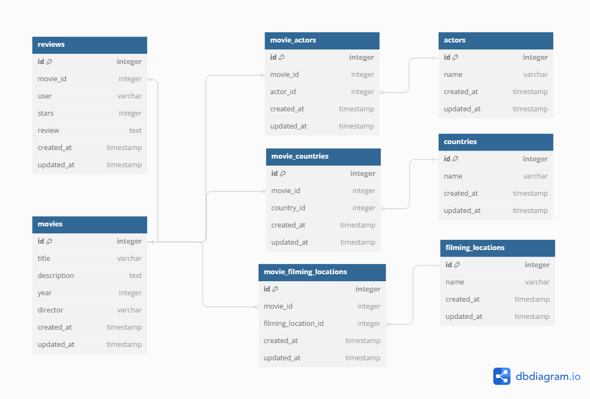

# Project Name

This README documents the necessary steps to get the application up and running.

## Table of Contents

- [Ruby and Rails Versions](#ruby-and-rails-versions)
- [System Dependencies](#system-dependencies)
- [Configuration](#configuration)
- [Start the APP](#start-the-app)
- [Database Schema](#database-schema)

## Ruby and Rails Versions

- Ruby version: `3.2.2`
- Rails version: `7.0.8.1`

## System Dependencies

To install system dependencies, run:

```bash
bundle install
```
## Configuration
create a .env file in the root directory with the following contents:

DATABASE_PASSWORD=your_password
DATABASE_USERNAME=your_username

## Start the APP

    rails db:create
    rails db:migrate
    rails s

## Database Schema


